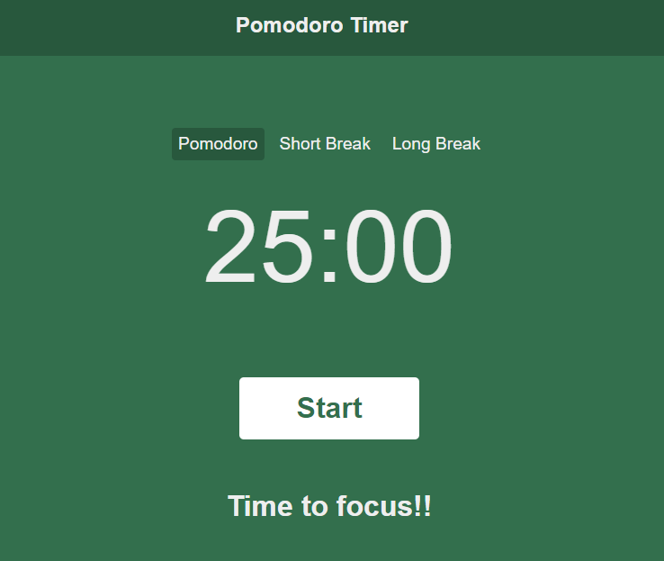

# Pomodoro Timer

The Pomodoro App is a time management tool based on the Pomodoro Technique. This technique involves breaking work into intervals of 25 minutes long, followed by short breaks of 5 minutes, and after 4 pomodoros a long break of 15 minutes.

